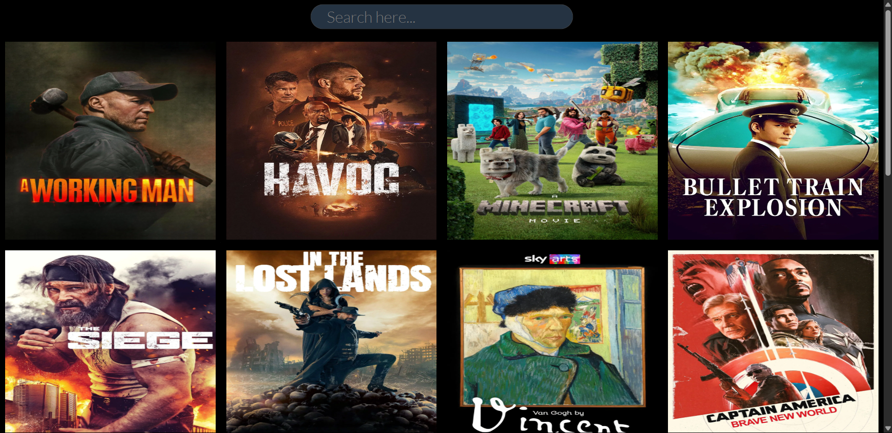

# MovieWorld
MovieWorld helps you find movies you will like.
Project Name: Movie Search & Suggestion Website📺

Description:

This project is a simple and responsive web application that allows users to search for movies and view suggestions in real-time. It uses the TMDB (The Movie Database) API to fetch and display popular movies, as well as search results based on user input.

Features:

Movie search📽️ with live suggestions

Display of popular movies by default

Fetches and displays movie posters, titles, ratings, and overviews

Responsive layout

Real-time data from TMDB API

Tech Stack:

HTML5

CSS3 (external stylesheet: style.css)

JavaScript (external script: app.js)

TMDB API

How It Works:

On page load, the app fetches popular movies from TMDB using the API.

When the user types in the search box, it fetches matching movie titles from the TMDB search endpoint.

The movie results (including image, title, rating, and overview) are displayed dynamically in the #movie-box container.

The movie data is updated in real-time as the user types.

How to Run:

Clone or download the project files.
git clone->  <h1>https://github.com/Harsh-P30/MovieWorld.git</h1>

Open the index.html file in your browser.

Make sure you're connected to the internet so the API requests can work.

No server is required — it runs completely in the browser.

API Details:

Base API URL: https://api.themoviedb.org/3

Popular Movies Endpoint:

https://api.themoviedb.org/3/discover/movie?sort_by=popularity.desc&api_key=YOUR_API_KEY&page=1
Search Endpoint:

https://api.themoviedb.org/3/search/movie?&api_key=YOUR_API_KEY&query=search_term

<h1>❤️ from Harsh</h1>